<!-- The frames in assets/ are generated from the portfolio's data: see generator/. -->


  <a href="https://sharllesse.github.io">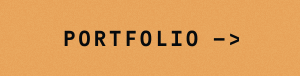</a>
  <a href="https://www.linkedin.com/in/charles-lesage-6971b129b/">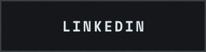</a>
  <a href="mailto:charles.lesage.pro@outlook.fr">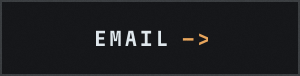</a>

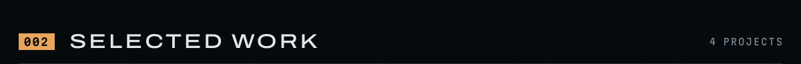

  <a href="https://github.com/Logicraft-Interactive/CoreUtils">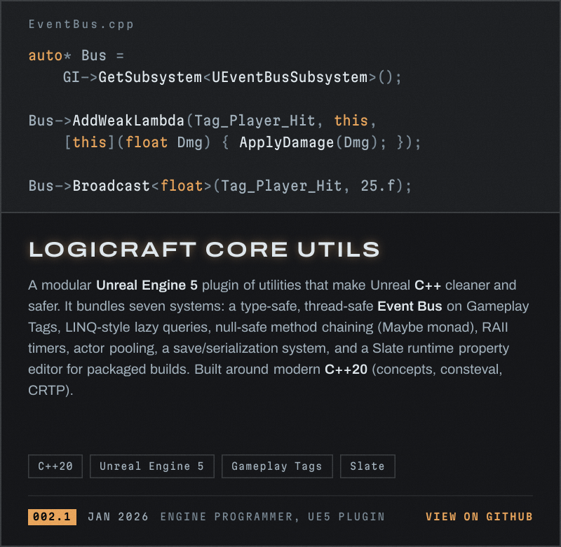</a>
  <a href="https://github.com/sharllesse/Reflection-Cpp">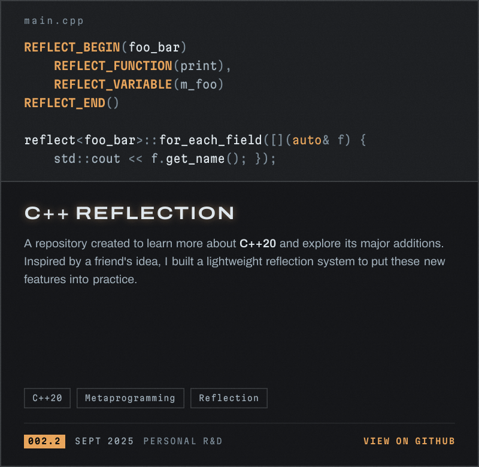</a>
  <a href="https://github.com/Xanhos/LogiCraft">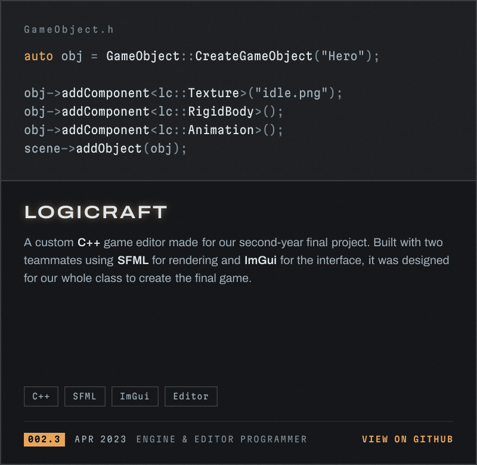</a>
  <a href="https://store.steampowered.com/app/2839290/Enter_The_Lost_Chamber/">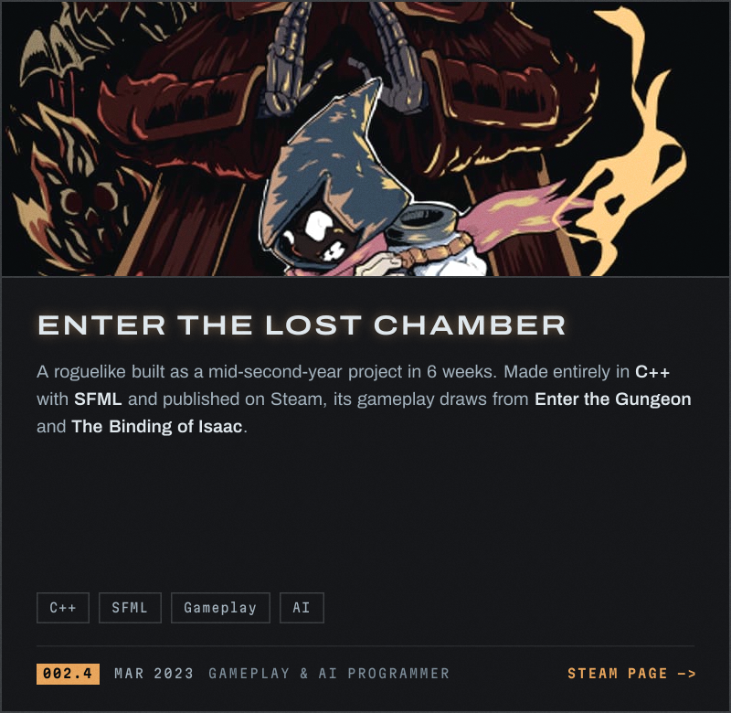</a>

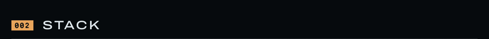

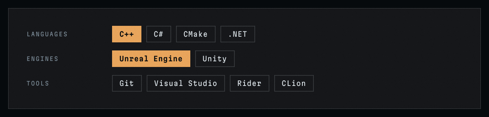

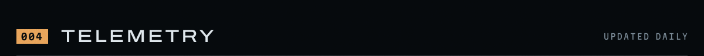

  

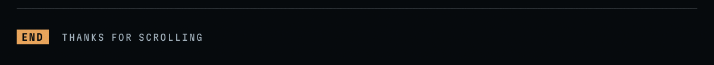
